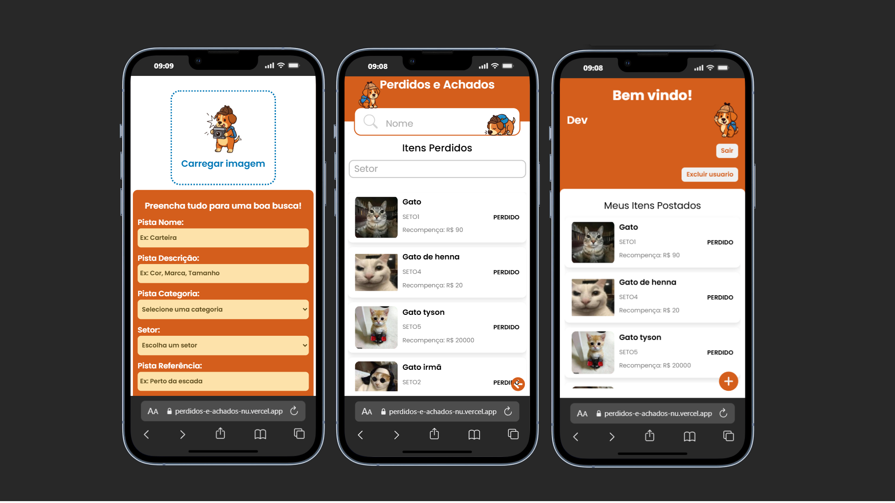

# 🕵️‍♂️ Perdidos-e-Achados: Sistema de Achados e Perdidos!

[](https://perdidos-e-achados-nu.vercel.app/)
[](LICENSE)

Este é o **Perdidos-e-Achados**, uma solução robusta e segura, inicialmente focada em **aeroportos**, mas com arquitetura totalmente adaptável para **cidades, shoppings, universidades** e qualquer outro ambiente que necessite de um sistema de Achados e Perdidos eficiente.

---

### 🌟 O Mascote Oficial: Sherdog

Conheça **Sherdog**, nosso fiel detetive e mascote, inspirado no lendário Sherlock Holmes. Ele garante que cada item perdido encontre seu caminho de volta para casa!

<p align="center">
  
</p>



### ✨ Funcionalidades em Destaque

O sistema foi construído pensando em **segurança, privacidade** e **facilidade de uso** para todos.

- 🔐 **Acesso Restrito e Seguro:**
  - **Usuários Não Logados:** Podem visualizar itens perdidos com **informações estritamente limitadas** (ex: Categoria, Local).
  - **Usuários Logados:** Têm acesso completo para **postar itens, entrar em contato** e gerenciar suas postagens.
- 📝 **Gerenciamento de Postagens:** Cadastro/login robusto com **Spring Security e JWT** para garantir a integridade dos dados.

---

### 🚀 Stack Tecnológica

Uma arquitetura moderna e escalável, dividida em três camadas.

| Camada             | Tecnologia Principal       | Bibliotecas/Frameworks            | Hospedagem / BD                |
| :----------------- | :------------------------- | :-------------------------------- | :----------------------------- |
| **Front-end**      | **React** (com Vite)       | Axios                             | [Vercel](https://vercel.com)   |
| **Back-end**       | **Java** (com Spring Boot) | Spring Security, JWT, DTO Pattern | [Render](https://render.com)   |
| **Banco de Dados** | **MySQL**                  | -                                 | [Railway](https://railway.app) |

---

### ⚙️ Instalação e Configuração

Siga os passos abaixo para ter o sistema rodando localmente.

#### 1. Configuração do Back-end (Spring Boot)

Clone o repositório e configure as variáveis de ambiente necessárias para a conexão com o banco de dados e segurança do JWT.

**Variáveis de Ambiente Necessárias:**

| Variável                     | Descrição                              | Exemplo                                  |
| :--------------------------- | :------------------------------------- | :--------------------------------------- |
| `SPRING_DATASOURCE_USERNAME` | Usuário do MySQL (Railway)             | `<usuario_do_banco>`                     |
| `SPRING_DATASOURCE_PASSWORD` | Senha do MySQL (Railway)               | `<senha_do_banco>`                       |
| `SPRING_DATASOURCE_URL`      | JDBC URL do Banco de Dados             | `jdbc:mysql://<host>:<porta>/<database>` |
| `JWT_SECRET`                 | Chave secreta longa para assinar o JWT | `<sua_chave_secreta>`                    |
| `TEMP`                       | Diretório temporário para uploads      | `/tmp/` ou `C:\temp`                     |
| `APP_CORS_ALLOWED_ORIGINS`   | Origem do Front-end (para CORS)        | `http://localhost:5173`                  |

#### 2. Configuração do Front-end (React + Vite)

Navegue até o diretório `frontend`, crie um arquivo `.env` e configure o endereço da API do Back-end.

```bash
# frontend/.env
VITE_URL_API=http://localhost:8080
```

## ▶️ Rodando o Projeto

Para iniciar o sistema **Perdidos-e-Achados** em ambiente local, siga os passos abaixo:

### 1. Frondt-end

- Certifique-se de ter **Node.js** >= 18 instalado.
- Navegue até a pasta `frontend`:
  ```bash
  cd frontend
  npm install
  npm run dev
  ```

### 2. Back-end

- Certifique-se de ter **Java 17** e **Maven** instalados.
- Navegue até a pasta `backend`:

  ```bash
  cd backend
  ./mvnw spring-boot:run
  ```

## 📄 Licença

Este projeto está sob a licença MIT.  
Veja o arquivo [LICENSE](./LICENSE) para mais detalhes.
